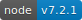
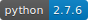
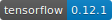

[]()
[]()
[]()
[]()
[]()
[]()
[]()


## Saturn Dockerfile

This repository contains **Dockerfile** of Saturn for Docker's automated build published to the public Docker Hub Registry.

### Base Docker Image

- [ubuntu:14.04](https://registry.hub.docker.com/u/library/ubuntu/)

### Build Docker

- Install [Docker](https://www.docker.com).

- Build

    ```bash
    git clone https://github.com/proin/saturn-docker
    cd saturn-docker
    docker build -t saturn .
    ```

### Usage

```bash
docker pull proin/saturn
docker run -it -p 3000:3000 proin/saturn
```
